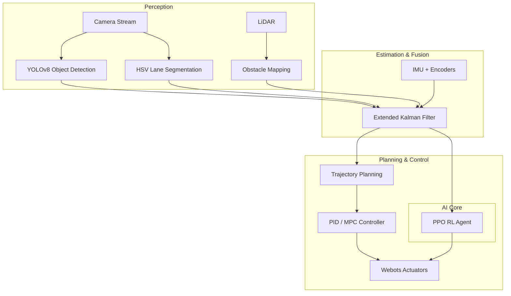

# 🏎️ Auto Car: Advanced Autonomous Driving Framework
### High-Performance ROS 2 (Jazzy) & Reinforcement Learning Suite for Webots

[](https://docs.ros.org/en/jazzy/)
[](https://www.python.org/)
[](https://isocpp.org/)
[](https://opensource.org/licenses/Apache-2.0)

`auto_car` is a robust, modular autonomous vehicle framework designed for high-fidelity simulation and real-time control. It bridges the gap between traditional control theory and modern AI by fusing **PID/MPC controllers** with **YOLOv8 perception** and **Deep Reinforcement Learning (PPO)**.

---

## 🏗️ System Architecture



---

## 🚀 Key Features

- **Multi-Modal Perception:** Real-time lane tracking combined with YOLOv8 inference for dynamic obstacle detection.
- **State Estimation:** Robust EKF-based fusion of LiDAR, IMU, and Wheel Encoders for precise localization.
- **RL-Ready Environment:** Custom Gymnasium environment integrated with ROS 2, enabling seamless PPO agent training.
- **Low-Latency Telemetry:** Real-time terminal dashboard monitoring speed, steering, and vision health without performance overhead.
- **Webots Integration:** Specialized world configurations for complex urban and highway scenarios.

---

## 🛠️ Installation & Setup

### Prerequisites
- ROS 2 Jazzy Jalisco
- Webots R2023b or later
- Python 3.10+ & C++17 compilers

### Build Instructions
```bash
# Clone the workspace
mkdir -p ~/auto_ws/src
cd ~/auto_ws/src
git clone https://github.com/Docprox-pixel/Autonomous-Vehicle-using-ROS2-and-Reinforcement-Learning.git

# Install dependencies
cd ~/auto_ws
rosdep install -i --from-path src --rosdistro jazzy -y

# Compile
colcon build --symlink-install
source install/setup.bash
```

---

## 🚦 Usage

### 1. Launch Simulation
Initialize the Webots environment along with the perception and planning stack:
```bash
ros2 launch auto_car sim.launch.py
```

### 2. Monitor Traffic & Vision
View the real-time CV pipeline stream:
```bash
ros2 run auto_car monitor_traffic
```

### 3. High-Speed Telemetry
Open the live dashboard for steering and speed analysis:
```bash
ros2 run auto_car telemetry_node.py
```

---

## 📄 License
This project is licensed under the Apache License 2.0 - see the [LICENSE](LICENSE) file for details.

## 🤝 Contributing
Contributions are welcome! Please open an issue or submit a pull request for any improvements.

---
*Developed by [Aryan Yadav](https://www.linkedin.com/in/aryan-yadav-1858632b5)*
